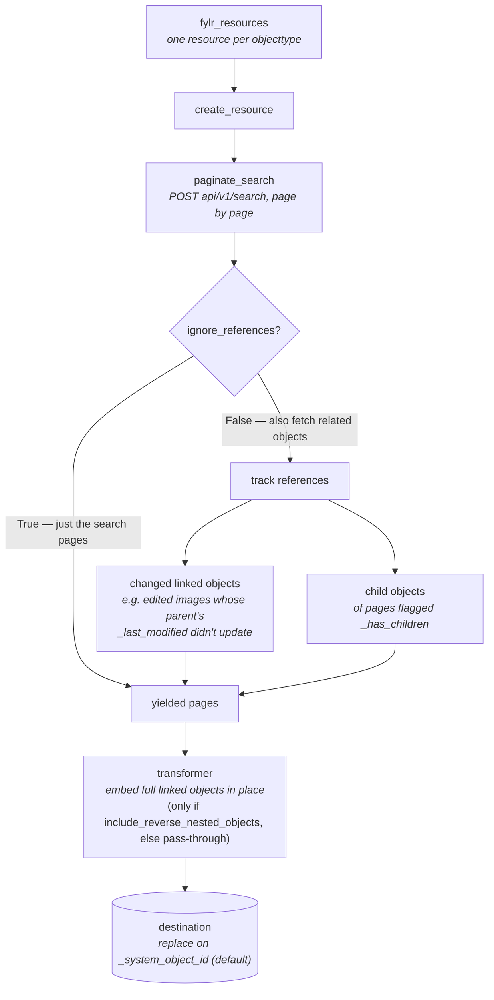

# dlt-source-fylr

Reusable [dlt](https://dlthub.com/) source building blocks for the
[fylr / easydb](https://docs.easydb.de/en/technical/api/) REST API.

This package contains the **generic, project-agnostic** machinery for
extracting data from a fylr instance:

- OAuth2 password-grant authentication (`FylrCredentials`,
  `OAuth2PasswordCredentials`)
- A configurable search + offset-pagination engine over `/api/v1/search`
- Incremental loading on `_last_modified`
- Reference / child-object tracking and reverse-nested object enrichment
- Runtime validation of the config against typed schemas (`FylrConfig`, …)

It deliberately contains **no** project-specific objecttype configuration
(objecttypes, pool filters, vocabulary URIs, …). You describe *what* to extract
in a `FylrConfig` and pass it to `fylr_resources`, which turns it into
authenticated, paginated, incremental dlt
[resources](https://dlthub.com/docs/general-usage/resource).

## Quick start

```python
import dlt
from fylr import fylr_resources, FylrConfig

config: FylrConfig = {
    "client": {
        "base_url": "https://example.fylr.io",
        "client_id": "...",
        "client_secret": "...",
        "username": "...",
        "password": "...",
    },
    "objecttypes": [
        {
            "name": "item",
            "search": {"objecttypes": ["item"], "format": "long"},
            "ignore_references": True,
        }
    ],
    "incremental": {"initial_value": "2024-01-01"},
}

resources = fylr_resources(config)

pipeline = dlt.pipeline(
    pipeline_name="fylr",
    destination="postgres",
    dataset_name="fylr_data",
)
pipeline.run(resources)
```

`fylr_resources` returns one dlt resource per entry in `objecttypes`. By default
each resource is written with [`replace`](https://dlthub.com/docs/general-usage/full-loading)
on primary key `_system_object_id`, normalizes nested JSON up to
`DLT_MAX_TABLE_NESTING = 3` levels into
[child tables](https://dlthub.com/docs/general-usage/destination-tables#nested-tables),
runs in section `fylr`, and is
[`parallelized`](https://dlthub.com/docs/general-usage/resource#declare-parallel-and-async-resources).
The write disposition, primary key, and nesting depth are all overridable per
objecttype — see [per-objecttype load behavior](#per-objecttype-load-behavior).

To wrap this in a [`@dlt.source`](https://dlthub.com/docs/general-usage/source)
that reads credentials/config from
[dlt config/secrets](https://dlthub.com/docs/general-usage/credentials), build
the `FylrConfig` inside your source function and
`yield from fylr_resources(config)` — see [Authentication](#authentication).

## The `FylrConfig` dict

`FylrConfig` is the declarative description of *what* to extract — the fylr
equivalent of the `rest_api` verified source's
[`RESTAPIConfig`](https://dlthub.com/docs/dlt-ecosystem/verified-sources/rest_api/basic).
It has three top-level keys:

| Key | Required | Type | Purpose |
| --- | --- | --- | --- |
| `client` | ✅ | `ClientConfig` | How to connect + authenticate. |
| `objecttypes` | ✅ | `list[ObjecttypeConfig]` | One entry per dlt resource — what to extract. |
| `incremental` | optional | `IncrementalValue` | Seed for the `{{incremental}}` cursor placeholder. |

```python
config: FylrConfig = {
    # 1. How to connect + authenticate (OAuth2 password grant)
    "client": {
        "base_url": "https://example.fylr.io",
        "client_id": "...",
        "client_secret": "...",
        "username": "...",
        "password": "...",
    },
    # 2. What to extract — one entry per dlt resource
    "objecttypes": [
        {
            "name": "item",                          # -> resource name
            "search": { ... },                       # fylr search body (see below)
            "ignore_references": False,              # follow linked/child objects
            "linked_objecttypes": [ ... ],           # catch unmarked changes
            "include_reverse_nested_objects": [ ... ],  # embed full linked objects
        },
    ],
    # 3. Incremental cursor seed (optional). Replaces {{incremental}} in searches.
    "incremental": {"initial_value": "2024-01-01"},  # "YYYY-MM-DD"
}
```

The dict is validated at runtime against the `FylrConfig`
[`TypedDict`](fylr/typing.py) by `validate_config` before anything runs, so a
malformed config fails fast with a clear `ValueError` (missing/unexpected keys)
or `TypeError` (wrong value type) — including nested `SearchConfig`,
`LinkedObjectConfig`, etc.

### `client` — connection & auth

`ClientConfig`, all keys **required**:

| Key | Description |
| --- | --- |
| `base_url` | Root URL of the fylr instance, no trailing slash (e.g. `https://example.fylr.io`). |
| `client_id`, `client_secret` | OAuth2 client credentials. |
| `username`, `password` | fylr account for the password grant. |

`create_client` turns this into a dlt
[`RESTClient`](https://dlthub.com/docs/api_reference/dlt/sources/helpers/rest_client/client#restclient-objects)
with `data_selector="objects"` (the API wraps results in an `objects` array) and
an [`OffsetPaginator`](https://dlthub.com/docs/api_reference/dlt/sources/helpers/rest_client/paginators#offsetpaginator-objects).
See [Authentication](#authentication) for the OAuth2 detail.

### `objecttypes[]` — what to extract

Each entry is an `ObjecttypeConfig`. `name` and `search` are required in
practice; the rest are optional.

| Key | Required | Default | Purpose |
| --- | --- | --- | --- |
| `name` | ✅ | — | Objecttype name; becomes the dlt resource name. |
| `search` | ✅ | — | The fylr search body POSTed to `api/v1/search`. |
| `ignore_references` | optional | `False` | Skip linked-objecttype and child-object tracking. |
| `linked_objecttypes` | optional | — | Related types to scan for *unmarked* changes. |
| `include_reverse_nested_objects` | optional | — | Reverse references to fetch in full and embed in place. |
| `write_disposition` | optional | `replace` | dlt write disposition: `append`, `replace`, or `merge`. |
| `primary_key` | optional | `_system_object_id` | Primary key column for the resource. |
| `max_table_nesting` | optional | `3` (`DLT_MAX_TABLE_NESTING`) | Max JSON nesting depth normalized into child tables. |

#### `search` — the fylr search query

A `SearchConfig` — essentially a pass-through of a raw
[fylr search](https://docs.easydb.de/en/technical/api/search/) body. The `search`
key (the list of search criteria) is the meaningful required part; every other
field is an optional pass-through to the API. The most-used fields:

| Field | Description |
| --- | --- |
| `search` | List of fylr search-criteria dicts (filters, ranges, `in`, …). |
| `objecttypes` | Objecttypes to query (usually `[name]`). |
| `format` | Response detail: `full` (incl. `_changelog`), `long` (all but `_changelog`), `standard` (preview), `short` (reference). |
| `sort` | Sort spec; `init_search` defaults to `_system_object_id` ASC. |
| `timezone` | Timezone for date filters (e.g. `Europe/Berlin`). |
| `offset`, `limit` | Pagination overrides (pagination is otherwise automatic). |
| `best_mask_filter`, `generate_rights`, `include_deleted`, `include_fields`, `exclude_fields`, `aggregations`, `highlight`, `fields`, `language` | Further fylr search options, passed through as-is. |

```python
"search": {
    "objecttypes": ["item"],
    "format": "long",
    "sort": [{"field": "_system_object_id", "order": "ASC", "_level": 0}],
    "timezone": "Europe/Berlin",
    "search": [
        # ... your own filters ...
        # incremental window — {{incremental}} is swapped for the cursor at runtime
        {
            "type": "range", "bool": "must",
            "field": "_last_modified",
            "from": "{{incremental}}", "to": None,
        },
    ],
}
```

The `{{incremental}}` placeholder is the contract that ties the static config to
dlt's incremental state — see [Incremental loading](#incremental-loading). It
may appear anywhere in the search dict; every occurrence is replaced at runtime.

#### `ignore_references` — fast path vs. full graph

- `False` (**default**) — enable reference tracking: scan `linked_objecttypes`
  for unmarked changes **and** follow child objects of any page flagged
  `_has_children`. Use this for correct incremental runs.
- `True` — skip both for a fast, plain search-only extraction. Use this for a
  quick complete refresh where you don't need to follow relationships.

`ignore_references` governs `linked_objecttypes` and child-object fetching only.
It does **not** affect `include_reverse_nested_objects`, whose transformer runs
in both modes.

#### `linked_objecttypes` — catching unmarked changes

fylr does **not** bump a parent object's `_last_modified` when a *linked* object
(e.g. an image, `objekt__bild`) changes. An incremental run keyed on
`_last_modified` would therefore miss those edits. Each `LinkedObjectConfig`
points at a linked objecttype and the JSON `path` back to the affected parent
IDs (both keys required):

```python
"linked_objecttypes": [
    {
        "path": "objekt__bild.lk_objekt._system_object_id",  # -> parent ids
        "search": {
            "objecttypes": ["objekt__bild"],
            "format": "long",
            "search": [
                {
                    "type": "range", "bool": "must",
                    "field": "_last_modified",
                    "from": "{{incremental}}", "to": None,
                },
            ],
        },
    },
],
```

`create_resource` searches these linked types, collects the parent IDs whose
links changed (`get_linked_object_ids`), removes any already seen in the normal
pages, and re-fetches the remainder at the end via `fetch_objects_by_ids`.
Only processed when `ignore_references = False`.

#### `include_reverse_nested_objects` — embedding full objects

By default a reverse-nested reference (e.g. an image linked back to an item)
arrives as a bare reference (Standard-format stub). List it here to fetch the
full object and splice it in place. Each `ReverseNestedObjectConfig` requires all
three keys:

```python
"include_reverse_nested_objects": [
    {
        "name": "_reverse_nested:objekt__bild:lk_objekt",  # must start with "_reverse_nested:"
        "format": "long",
        "path": "lk_bild.bild",                            # where to splice the full object in
    },
],
```

When set, the base resource is renamed `<name>_base` and a dlt
[**transformer**](https://dlthub.com/docs/general-usage/resource#process-resources-with-dlttransformer)
keeping the original `name` does the enrichment: it collects referenced IDs
across the whole batch, fetches them in one chunked search, and replaces each
reference with the full object via
[`set_value_at_path`](https://dlthub.com/docs/api_reference/dlt/common/jsonpath#set_value_at_path).
`name` **must** start with `_reverse_nested:` or the transformer raises.

#### Per-objecttype load behavior

By default every resource is written with `replace`, keyed on
`_system_object_id`, and nested up to `DLT_MAX_TABLE_NESTING = 3` levels. Override
any of these per objecttype to change how that resource lands in the destination:

| Key | Default | Accepts |
| --- | --- | --- |
| `write_disposition` | `replace` | `append`, `replace`, `merge` |
| `primary_key` | `_system_object_id` | any column name |
| `max_table_nesting` | `3` (`DLT_MAX_TABLE_NESTING`) | any non-negative int |

```python
"objecttypes": [
    {
        "name": "item",
        "search": {"objecttypes": ["item"], "format": "long"},
        "write_disposition": "merge",   # incremental upsert instead of full replace
        "primary_key": "_system_object_id",
        "max_table_nesting": 5,         # flatten deeper structures into child tables
    },
],
```

All three apply to the objecttype's resource **and**, when
`include_reverse_nested_objects` is configured, to the reverse-nested transformer
that carries the final table — so the base resource and its transformer stay in
sync. Omit a key to keep the default.

### `incremental` — cursor seed

Optional `IncrementalValue` with a single required key, `initial_value`, a
`YYYY-MM-DD` string:

```python
"incremental": {"initial_value": "2024-01-01"},
```

This seeds a dlt [`incremental`](https://dlthub.com/docs/general-usage/incremental-loading)
on `_last_modified`. See [Incremental loading](#incremental-loading) for how the
value flows into `{{incremental}}`.

## How extraction works

`fylr_resources` builds one dlt resource per objecttype; the per-resource
generator is `create_resource`:

1. **Search & paginate** — POST the `search` body to `api/v1/search`, page
   through results with an `OffsetPaginator` (`MIN_PAGE_SIZE = 100` items/page,
   hard cap `MAX_PAGE_SIZE = 1000`). `paginate_search` is the shared entry point.
2. **Incremental expansion** — if an incremental object is present,
   `expand_incremental_placeholders` walks the search dict and swaps every
   `{{incremental}}` for the current cursor value *before* the request goes out.
3. **Reference tracking** (`ignore_references = False` only):
   - **Linked objects** — `get_linked_object_ids` collects parent IDs from
     `linked_objecttypes`; IDs already seen in normal pages are removed, and the
     remainder fetched at the end via `fetch_objects_by_ids`.
   - **Child objects** — pages flagged `_has_children` trigger a follow-up search
     on `{objecttype}._parents.{objecttype}._id`.
4. **Reverse-nested enrichment** — if `include_reverse_nested_objects` is set, a
   transformer (bound with `resource | transformer`) embeds the full objects.

Batched fetches use [`@dlt.defer`](https://dlthub.com/docs/examples/transformers#full-source-code)
so dlt resolves chunks in parallel across its thread pool.



## Authentication

fylr uses **OAuth2 password grant**, which dlt's built-in helpers don't send out
of the box. [`auth.py`](fylr/auth.py) subclasses `OAuth2ClientCredentials` to add
the `grant_type=password` token request against `{base_url}/api/oauth2/token`
(scope `offline`):

```python
@configspec
class OAuth2PasswordCredentials(OAuth2ClientCredentials):
    def build_access_token_request(self) -> Dict:
        return {
            "headers": {"Content-Type": "application/x-www-form-urlencoded"},
            "data": {
                "client_id": self.client_id,
                "client_secret": self.client_secret,
                **self.access_token_request_data,  # grant_type, username, password, scope
            },
        }
```

`create_client` wires this up for you from the `client` config — you only supply
the five `ClientConfig` fields.

### Resolving credentials from dlt secrets

When you build a `@dlt.source` on top of this package, don't hard-code the five
`client` fields. Group the four secret fields into the provided
`FylrCredentials` [configspec](https://dlthub.com/docs/general-usage/credentials/advanced)
so dlt resolves them from `.dlt/secrets.toml` (or env vars) **and** doesn't fall
back to bare environment names (e.g. picking up the OS `USERNAME` variable):

```toml
# .dlt/secrets.toml
[sources.fylr.credentials]
client_id = "..."
client_secret = "..."
username = "..."
password = "..."
```

```python
import dlt
from fylr import FylrCredentials, fylr_resources

@dlt.source(name="fylr")
def fylr_source(
    base_url: str = dlt.config.value,
    credentials: FylrCredentials = dlt.secrets.value,
):
    config = {
        "client": {
            "base_url": base_url,
            "client_id": credentials.client_id,
            "client_secret": credentials.client_secret,
            "username": credentials.username,
            "password": credentials.password,
        },
        "objecttypes": [ ... ],
    }
    yield from fylr_resources(config)
```

The equivalent env vars use dlt's
[double-underscore convention](https://dlthub.com/docs/general-usage/credentials/setup),
e.g. `SOURCES__FYLR__CREDENTIALS__USERNAME`.

## Incremental loading

The `_last_modified` field is the cursor. `create_incremental_object` builds a
dlt [`incremental`](https://dlthub.com/docs/general-usage/incremental-loading)
seeded from `incremental.initial_value` (validated as `YYYY-MM-DD`, expanded to
`...T00:00:00Z`). On each run dlt provides the last-loaded timestamp as
`start_value`, and `expand_incremental_placeholders` injects it wherever
`{{incremental}}` appears in the search — so only objects changed since the last
run are fetched.

Put the `{{incremental}}` placeholder in a `_last_modified` range filter in each
objecttype's `search` (and in any `linked_objecttypes[].search`). If you omit the
`incremental` key entirely, no placeholder expansion happens and the searches run
as written.

## Limiting output (testing)

`fylr_resources(config, yield_limit=...)` caps the number of items yielded per
resource via [`add_limit`](https://dlthub.com/docs/general-usage/resource#sample-from-large-data).
Pass a positive integer for quick test runs; `None` or `<= 0` means no limit.

```python
resources = fylr_resources(config, yield_limit=50)  # at most 50 items per resource
```

## Tunable constants ([settings.py](fylr/settings.py))

Not exposed through the config dict — change in code if needed:

| Constant | Default | Meaning |
| --- | --- | --- |
| `MIN_PAGE_SIZE` | `100` | Items per search page (and per batched id-fetch). |
| `MAX_PAGE_SIZE` | `1000` | Hard cap; larger page sizes raise `ValueError`. |
| `INCREMENTAL_CURSOR_PATH_FIELD` | `_last_modified` | Field used as the incremental cursor. |
| `INCREMENTAL_PLACEHOLDER` | `{{incremental}}` | Token replaced with the cursor value. |
| `SEARCH_TIMEZONE` | `Europe/Berlin` | Default timezone injected by `init_search`. |
| `DLT_MAX_TABLE_NESTING` | `3` | Default max JSON nesting depth into child tables (override per objecttype with [`max_table_nesting`](#per-objecttype-load-behavior)). |

## Public API

The package is importable as `fylr`. See `fylr.__all__` for the full list of
exported symbols — the main entrypoint is `fylr_resources`, with the config
`TypedDict`s (`FylrConfig`, `ClientConfig`, `ObjecttypeConfig`, `SearchConfig`,
`LinkedObjectConfig`, `ReverseNestedObjectConfig`, `IncrementalValue`,
`SearchFormatType`) and lower-level helpers (`create_client`, `init_search`,
`paginate_search`, `create_resource`, `create_incremental_object`, …) available
for advanced use.

## Development

```bash
uv sync
```
